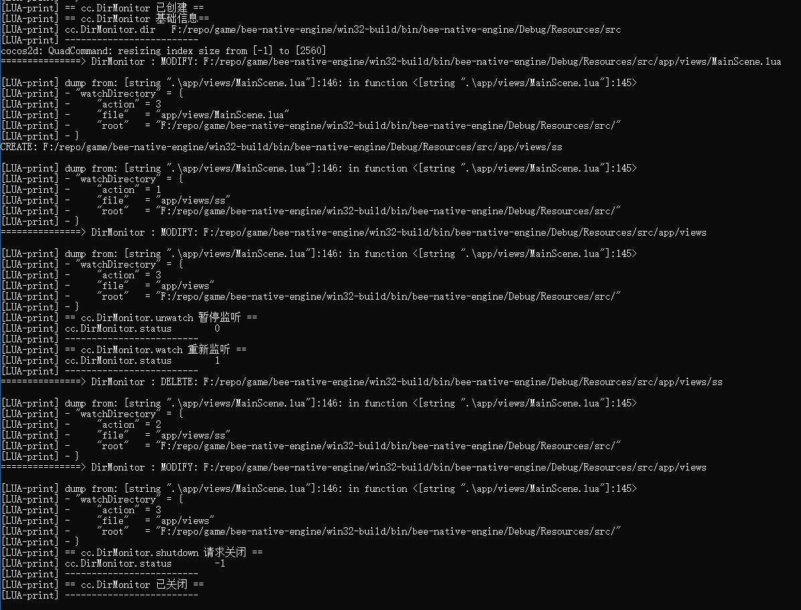

# cocos2d-x-dir-monitor

## 一、介绍

**cocos2d-x-dir-monitor** 是内嵌到 Cocos2d-x 中的目录监视器，用以检测文件变化，比如：

- 新增
- 修改
- 删除
- 移动

也就是说，借助目录监视器，我们就可以获取变动的文件。这个尤其在使用 Lua 开发时有用，因为 **Lua 热重载的基础就是检测文件变化，针对变化的文件决定是否进行热重载，以及热重载的策略**。

# 二、实现

**cocos2d-x-dir-monitor** 的目录检测基于 [dmon](https://github.com/septag/dmon)，因为是单文件，所以移植也很简单。

首先把它 `clone` 下来，提取有用的文件丢到 `cocos2d-x` 的 `external/bmon` 下。

然后，把它添加到附加包含目录中，编译一下。

接着，我们来封装一下接口。

让我们看看它的测试用例：

```cpp
#include <stdio.h>

#define DMON_IMPL
#include "dmon.h"

static void watch_callback(dmon_watch_id watch_id, dmon_action action, const char* rootdir,
                           const char* filepath, const char* oldfilepath, void* user)
{
    (void)(user);
    (void)(watch_id);

    switch (action) {
    case DMON_ACTION_CREATE:
        printf("CREATE: [%s]%s\n", rootdir, filepath);
        break;
    case DMON_ACTION_DELETE:
        printf("DELETE: [%s]%s\n", rootdir, filepath);
        break;
    case DMON_ACTION_MODIFY:
        printf("MODIFY: [%s]%s\n", rootdir, filepath);
        break;
    case DMON_ACTION_MOVE:
        printf("MOVE: [%s]%s -> [%s]%s\n", rootdir, oldfilepath, rootdir, filepath);
        break;
    }
}

int main(int argc, char* argv[])
{
    if (argc > 1) {
        dmon_init();
        puts("waiting for changes ..");
        dmon_watch(argv[1], watch_callback, DMON_WATCHFLAGS_RECURSIVE, NULL);
        getchar();
        dmon_deinit();
    } else {
        puts("usage: test dirname");
    }
    return 0;
}
```

可见，使用非常简单：

1. `dmon_init` 可以理解为初始化一个目录监视器
2. `dmon_watch` 可以理解为开始对某个目录进行监视，并添加回调 `watch_callback`
3. `dmon_uninit` 可以理解为关闭监视器

实际使用中，我们需要传递一个目录 `dir` 参数；另外，为了反馈结果给 Lua 层，还需要传递一个 `LUA_FUNCTION` 进去。为了有效控制监听，还可以加上取消监听接口。

所以，它大概是这样子的：

```cpp
public class DirMonitor {
  public:
    staic DirMonitor* create(string dir, LUA_FUNCTION func);
    void watch();
    void unwatch();
    void shutdown();
  // ...
}
```

> `dmon_watch` 返回一个结构体 `dmon_watch_id`，里面存放了一个 `id`，权且把它当作监听的目录句柄，取消监听时需要传入此句柄，即 `dmon_unwatch(dmon_watch_id id)`。


## 三、使用

上述的接入过程这边已经搞定了，并且还贴心地给各位准备了 `Lua Binding` 接口，大家可以放心食用，只需要稍微动下你的手指 _(顺便点个Star)_：

1. 将 `Classes` 下文件导入 `Cocos2d-x` 工程
2. 在 `AppDelegate.cpp` 中引入 `lua-dir-monitor.h`
3. 在 `applicationDidFinishLaunching` 中调用 `lua_module_register_dir_monitor(L)` 注册即可

以下是在 Lua 层运行的测试用例，这里监视的是 Lua 源码目录 `src`，你可以根据需要来测试 `新增、修改、删除、移动` 是否有效：

```lua
function watchDirectory(node)
    local root = cc.FileUtils:getInstance():getDefaultResourceRootPath() .. 'src'
    local fw =
        cc.DirMonitor:create(
        root,
        function(dict)
            dump(dict, 'watchDirectory')
        end
    )
    if tolua.isnull(fw) then
        print('== cc.DirMonitor 创建失败 ==')
        return
    end
    print('== cc.DirMonitor 已创建 ==')

    -- 输出DirMonitor基础信息
    print('== cc.DirMonitor 基础信息==')
    print('cc.DirMonitor.dir ', fw:dir())
    print('-------------------------')

    -- 启动监听
    fw:watch()

    -- 用延时来观察DirMonitor暂停/恢复/关闭情况
    local time_handler_1 = function()
        fw:unwatch()
        print('== cc.DirMonitor.unwatch 暂停监听 ==')
        print('cc.DirMonitor.status', fw:status())
        print('-------------------------')
    end
    local time_handler_2 = function()
        fw:watch()
        print('== cc.DirMonitor.watch 重新监听 ==')
        print('cc.DirMonitor.status', fw:status())
        print('-------------------------')
    end
    local time_handler_3 = function()
        fw:shutdown()
        print('== cc.DirMonitor.shutdown 请求关闭 ==')
        print('cc.DirMonitor.status', tolua.isnull(fw) and -1 or fw:status())
        print('-------------------------')
    end
    local time_handler_4 = function()
        if tolua.isnull(fw) then
            print('== cc.DirMonitor 已关闭 ==')
            print('-------------------------')
            return
        end
    end

    performWithDelay(node, time_handler_1, 20) -- 20秒后暂停，对目录操作无效
    performWithDelay(node, time_handler_2, 40) -- 40秒后恢复，对目录操作有效
    performWithDelay(node, time_handler_3, 60) -- 60秒后关闭，对目录操作无效
    performWithDelay(node, time_handler_4, 80) -- 80秒后检测，此时fw无效了
end
```

-   运行结果


